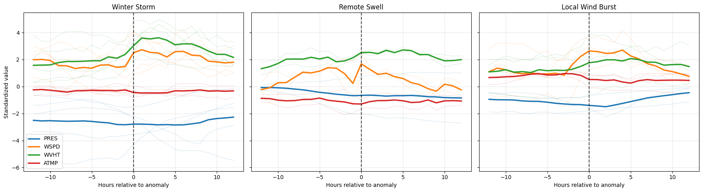

## NOAA Buoy Anomaly Detection
Time Series Anomaly Detection on NOAA Buoy Sensor Data

## Project Overview
This project analyzes environmental sensor data collected from an Oregon-based NOAA (National Oceanic and Atmospheric Administration) buoy station to detect anomalous ocean and atmospheric events. Time-series modeling and unsupervised machine learning techniques are applied to identify unusual patterns in wind speed, wave height, pressure, and temperature data.

## Methods
- SARIMA residual modeling
- DBSCAN clustering
- Isolation Forest
- Time-series feature engineering

